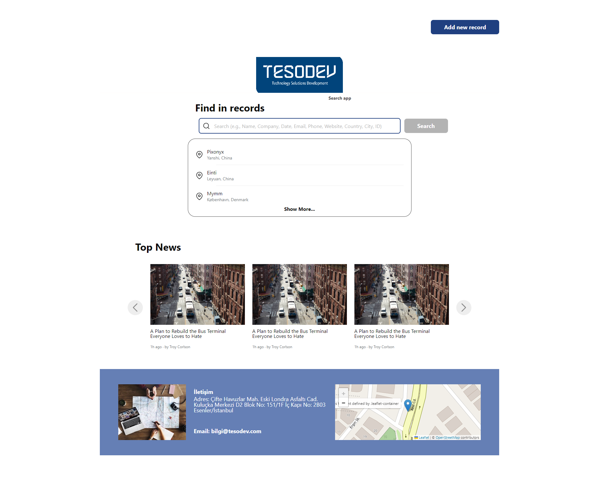
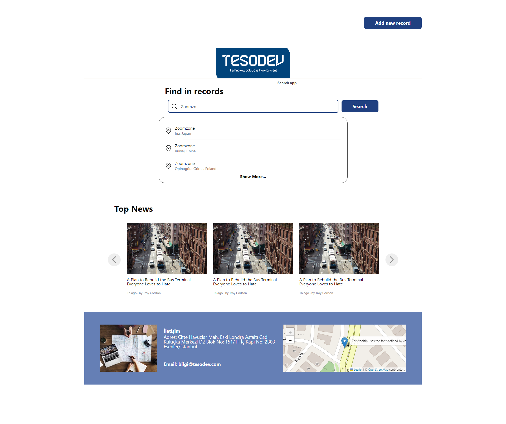
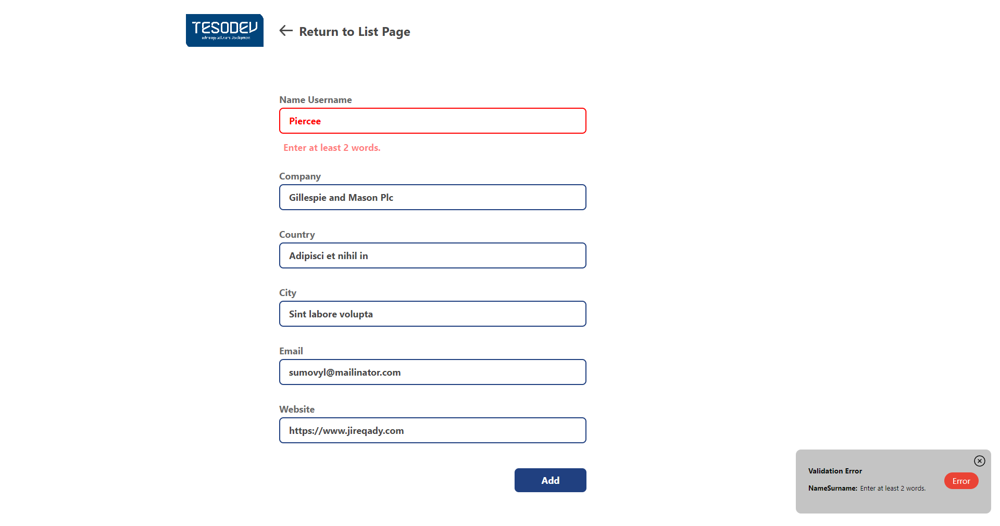
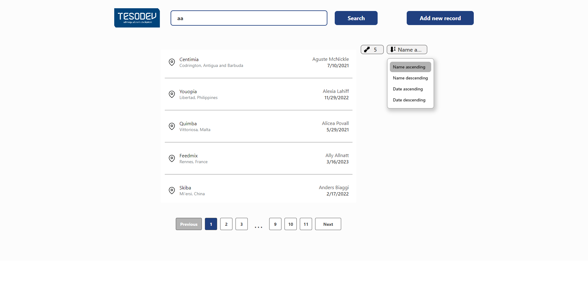

# Tesodev Case Study


## Search App

#### A search engine was created with this case study.

- We can filter our data with any of the keys id, name, company, email, phone, website, country, city, date.
- In addition, after searching, we can see these searches on the search list page and we can sort them in this section.
- When we want to add data, we can go to the add page and add our new data.
- With the Pagination feature, we can control our data more easily.
- We can also update how many data we can see in the pagination according to our wishes.

#### Operations performed during project creation

- The data used for the search is taken from the json file that comes with the case declaration and converted to an appropriate Object with a loop.

```bash
const data = JSONFILE
const cols = data.cols;

const organizedData = data.data.map((row) => {
  const rowData = {};
  cols.forEach((col, index) => {
    rowData[col] = row[index];
  });
  return rowData;
});

console.log(organizedData);
```

- The object was converted into a Restful API with Node.js and launched on the Heroku platform.
- The project itself was also deployed on Heroku.
- The API supports GET and POST requests for now, but other methods will be added as the project develops.
- In the project, a dynamic structure was established by paying attention to React rendering and state management. Context API was used to provide and manage this structure.
- Styled Component was used for the css part. In this context, examples of dynamic operations with styled component are available in the project.
- Functional coding was done in the whole project. In this context, the operations to be performed with auxiliary functions were written under the utils folder.
- The react-router-dom library was used for routing operations. In this context, our homepages and related paths were created in the folder named routes.
- In the project created entirely with components, general components used dynamically were included. For example, input, button etc.
- Completely written code for pagination. No library was used.
- Completely written code for search and sorting. No auxiliary library was used.
- Since features such as pagination, search and sorting are done with Context API, a structure that is interconnected and works properly has been established thanks to state management. The benefit of this is that, for example, we want to add a new sorting feature; it will be enough to add a new key to our related state. The same applies to the items per page property.
- Auxiliary libraries were used for Slider and Map fields.
- Although it is not a responsive design, responsive feature was added.

## Dependencies

- React
- React Router Dom
- React Leaflet (for map)
- React Simply Carousel (for slider)
- Styled Components 
- Styled Reset

## Installation

First of all, we need to convert our json file, which we will use as db using json-server, to API.
We can set up our project in the local environment by running the codes below in order.

```bash
npm install json-server
json-server --watch db.json
```

```bash
npm install
npm start
```

_In order for the project to work properly before launching it locally, you need the correct json file containing the data to be used as db. If you do not have this json file, you need to update the **apiUrl** in the config file._


## Examples
Some in-app images

| Image 1 | Image 2 |
| ------- | ------- |
|  |  |
| Homepage | Filtered Homepage |

| Image 3 | Image 4 |
| ------- | ------- |
|  |  |
| Add Form Page | List Page |


